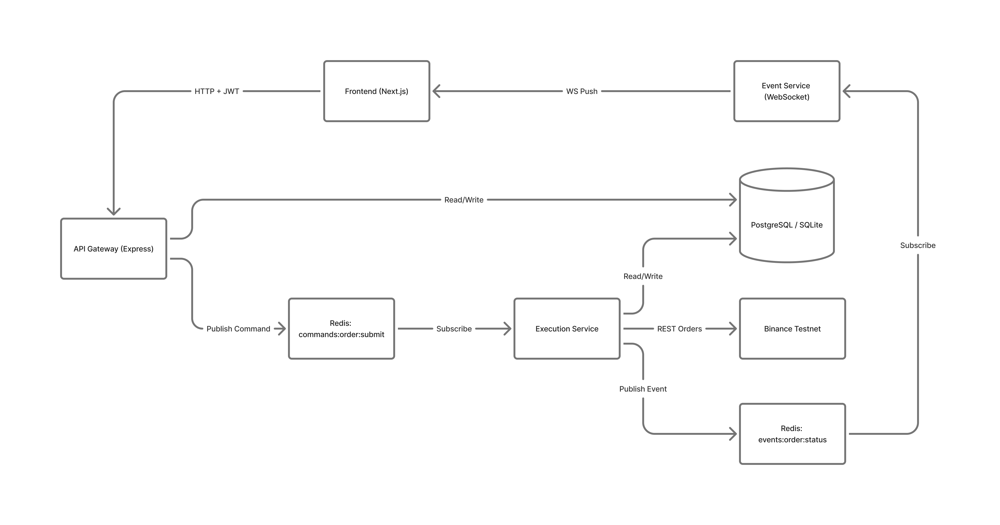

### ☐ Real Time Trading Platform
It is a real-time trading platform built with a microservices architecture. It combines a Next.js frontend, a FastAPI backend, and a Redis-based event system to enable seamless order execution, real-time market data, and WebSocket-driven updates.

The system is designed for low-latency trading workflows, with services decoupled via Redis pub/sub and state persisted in PostgreSQL. It supports order routing to exchanges (e.g., Binance), real-time position/order/trade updates, and a responsive UI for trading, charting, and portfolio management.

<p align="center">
  
</p>

Live Link - https://numatix-assessment.vercel.app/
<Br/>
Video Link - https://drive.google.com/drive/folders/1WFKXhTIDk0Kf44pvw7qIek7MwzrxZrFM?usp=sharing
<Br/>
Github Repo Link - https://github.com/harshkunz/Numatix_Assessment

### ☐ Tech Stack Used

**Backend:**
- Node.js with Express.js
- Redis (for message bus)
- PostgreSQL - Supabase
- JWT authentication
- Binance Testnet API

**Frontend:**
- Next.js @latest
- TypeScript
- lightweight-charts
- WebSocket client
- Tailwind CSS

**Repository Structure:**
- Monorepo architecture
- (Client service, Api gateway service, Execution service, Event service)

**Deployment:**
- Vercel
- Render

### ☐ Workflow

<p align="center">
  
</p>

1. **User Authentication**
   - User registers/logs in via the frontend.
   - Frontend sends credentials to the backend API.
   - Backend validates credentials, generates JWT, and returns it to the frontend.

2. **Trading Order Submission**
   - User submits a trading order through the frontend UI.
   - Frontend sends the order request to the backend API.
   - Backend validates the order, stores it in the database, and publishes the order event to Redis.

3. **Order Execution**
   - Execution service consumes order events from Redis.
   - Execution service processes the order (e.g., places it on Binance via the Binance API).
   - Execution service updates the order status and publishes execution results back to Redis.

<p align="center">
  
</p>

4. **Real-time Updates (WebSocket)**
   - Event service subscribes to Redis for order and execution events.
   - Event service broadcasts real-time updates to connected frontend clients via WebSocket.

<p align="center">
  
</p>

5. **Frontend Display**
   - Frontend listens for WebSocket events from the event service.
   - UI updates dynamically with new order status, positions, and trade history.

6. **Database Sync**
   - All order and user data is persisted in PostgreSQL via Prisma ORM.
   - Prisma migrations ensure schema changes are tracked and applied.

<p align="center">
  
</p>

### ☐ Project Structure
``` Java

Numatix_Assessment/
├── apps/
│   ├── backend/              # API Gateway
│   │   ├── src/{config, routes, controllers, middlewares, services, validators, utils, types}
│   │   ├── prisma/
│   │   ├── package.json
│   │   └── Dockerfile
│   ├── execution-service/    # Order Execution Worker
│   │   ├── src/{config, consumers, services, repositories, utils, types}
│   │   ├── prisma/
│   │   ├── package.json
│   │   └── Dockerfile
│   ├── event-service/        # WebSocket Broadcaster
│   │   ├── src/{config, websocket, subscribers, utils, types}
│   │   ├── package.json
│   │   └── Dockerfile
│   └── frontend/             #  Client
│       ├── src/{app, components, hooks, store, services, utils, styles, types}
│       ├── public/
│       ├── package.json
│       └── Dockerfile
│
├── packages/
│   └── shared/
│
├── .github/workflows/ci.yml
├── docker-compose.yml
├── turbo.json
├── tsconfig.base.json
├── package.json
└── README.md

```

### ☐ API's Endpoint & Response

#### 1. Authentication System

Implement:
- `POST /auth/register`
  - Accepts: `{ email, password, binanceApiKey, binanceSecretKey }`
  - Stores user with hashed password (bcrypt)
  - Stores Binance keys securely (encrypted in DB)
  - Returns JWT token

- `POST /auth/login`
  - Accepts: `{ email, password }`
  - Validates credentials
  - Returns: `{ token, user: { id, email } }`

- JWT middleware for protected routes
- All trading endpoints require valid JWT

#### 2. API Gateway - Order Endpoints

Implement in your Express.js API Gateway:

- `POST /api/trading/orders`
  - **Request:**
    ```json
    {
      "symbol": "BTCUSDT",
      "side": "BUY" | "SELL",
      "type": "MARKET",
      "quantity": 0.001
    }
    ```
  - **Flow:**
    1. Validate JWT token
    2. Extract user ID from token
    3. Validate request body
    4. **Publish command to Redis** (do NOT call Binance directly)
    5. Return: `{ orderId, status: "PENDING" }`

  - **Redis command format:**
    ```
    Channel: commands:order:submit
    Message: {
      "orderId": "uuid",
      "userId": "user-id-from-token",
      "symbol": "BTCUSDT",
      "side": "BUY",
      "type": "MARKET",
      "quantity": 0.001,
      "timestamp": "2024-01-01T00:00:00Z"
    }
    ```

- `GET /api/trading/orders`
  - Returns all orders for authenticated user
  - Fetch from database (orders logged by Event Service)

- `GET /api/trading/positions`
  - Returns current positions for authenticated user
  - Calculate from filled orders

#### 3. Order Execution Service (Separate Service)

Create a separate service/process that:

1. **Subscribes to Redis:**
   - Channel: `commands:order:submit`
   - Consumes order commands

2. **Executes orders:**
   - For each command:
     - Extract user's Binance API keys from database
     - Call Binance Testnet REST API to place order
     - Handle success/failure

3. **Publishes events to Redis:**
   - Channel: `events:order:status`
   - Message format:
     ```json
     {
       "orderId": "uuid",
       "userId": "user-id",
       "status": "FILLED" | "REJECTED" | "PARTIALLY_FILLED",
       "symbol": "BTCUSDT",
       "side": "BUY",
       "quantity": 0.001,
       "price": 67200.12,
       "timestamp": "2024-01-01T00:00:00Z"
     }
     ```

4. **Logs to database:**
   - Store all order commands in `order_commands` table
   - Store all order events in `order_events` table
   - Schema:
     ```sql
     order_commands:
       id, userId, orderId, symbol, side, type, quantity, status, createdAt
     
     order_events:
       id, orderId, userId, status, price, quantity, timestamp, createdAt
     ```

#### 4. Event Broadcasting Service (Separate Service)

Create another service that:

1. **Subscribes to Redis events:**
   - Channel: `events:order:status`

2. **Broadcasts to frontend via WebSocket:**
   - Maintain WebSocket connections per user
   - When order event received, broadcast to user's WebSocket
   - Message format:
     ```json
     {
       "type": "ORDER_UPDATE",
       "data": {
         "orderId": "uuid",
         "status": "FILLED",
         "symbol": "BTCUSDT",
         "price": 67200.12
       }
     }
     ```

3. **WebSocket endpoint:**
   - `ws://your-backend/prices`
   - Requires JWT token in connection handshake
   - Associate WebSocket with user ID

### ☐ Installation
#### 1. Clone the repository
```bash
  git clone https://github.com/harshkunz/Numatix_Assessment
  cd Numatix_Assessment
```

#### 2. Backend API Gateway
```bash
  cd app
  npm install       # Install Dependencies
  npm run dev       # Run Server
```
Runs at `http://localhost:7001`

#### 3. Execution Service (Worker)
```bash
  cd app
  npm install       # Install Dependencies
  npm run dev       # Run Server
```
Starts the Redis consumer

#### 4. Event Service (WebSocket)
```bash
  cd app
  npm install       # Install Dependencies
  npm run dev       # Run Server
```
Runs at `http://localhost:8080` (WebSocket: `ws://localhost:8080`)

#### 5. Frontend (Next.js 16)
```bash
  cd app
  npm install       # Install Dependencies
  npm run dev       # Run Server
```
Runs at `http://localhost:3000`

#### 6. Database Setup
```bash
  cd ..services
  npx prisma migrate dev
  npx prisma generate
```

##### 7. Environment Variables
copy `.env.example`.
```bash
  .env 
```

### ☐ Contributing
Open to contributions!
- Fork the repository  
- Create a new branch (`git checkout -b feature-name`)  
- Commit your changes (`git commit -m 'Add feature'`)  
- Push to the branch (`git push origin feature-name`)  
- Create a Pull Request
